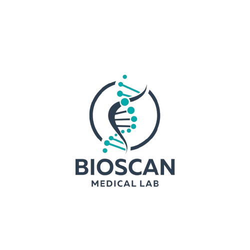

<div align="center">
  

  <h1>BioScan</h1>
  <p><strong>Hybrid Cloud Platform for Medical Data Analysis and Security</strong></p>

  <p>
    
    
    
    
    
  </p>
</div>

---

BioScan is an intelligent web platform that automatically analyzes biological lab results and secures sensitive medical documents. Built as an academic project by a team of 5 students specializing in Cloud Computing and Cybersecurity.

---

## Features

### Biological Analysis
- Upload CSV / Excel files containing lab results
- Automatic detection of abnormal values and biological inconsistencies using a reference-range engine
- Report generation in PDF and JSON formats

### Medical Document Security
- Upload PDF or image medical documents
- OCR-based extraction (Tesseract) of document text
- Detection of sensitive PII: names, ID numbers, emails, phone numbers
- Antivirus scan via ClamAV
- Document anonymization

### Authentication & Access Control
- JWT-based authentication
- OTP / Two-Factor Authentication (TOTP)
- Forgot-password flow with email verification
- Role-based access: each user role sees a dedicated dashboard

---

## Architecture

```
BioScan/
├── backend/               # FastAPI application
│   ├── main.py            # App entry point, CORS, router registration
│   ├── database.py        # SQLAlchemy engine & session
│   ├── schema.sql         # PostgreSQL schema (enums, tables, seed data)
│   ├── api/routers/       # Route handlers (auth, bilan, profil, admin, notifications…)
│   ├── models/            # SQLAlchemy ORM models
│   ├── schemas/           # Pydantic request/response schemas
│   ├── medical_engine/    # Anomaly analyzer with reference ranges & explanations
│   ├── parsers/           # CSV / Excel / PDF ingestion
│   ├── services/          # Business logic (notifications, reports…)
│   └── utils/             # Shared helpers
└── frontend/              # React application
    └── src/
        ├── pages/         # Role-based page sets (Admin, MedecinBiologiste, technicien, Patient)
        ├── components/    # Shared UI components (sidebars, topbars, modals…)
        ├── layouts/       # Per-role layout wrappers
        ├── services/      # Axios API clients
        ├── hooks/         # Custom React hooks
        └── theme/         # MUI theme configuration
```

---

## Tech Stack

| Layer | Technology |
|---|---|
| Backend | FastAPI (Python), Uvicorn |
| Database | PostgreSQL, SQLAlchemy |
| Frontend | React 18, Material UI v7, React Router v7 |
| Charts | Chart.js, Recharts |
| AI / Analysis | Pandas, NumPy, Scikit-learn |
| OCR | Tesseract (pytesseract + Pillow) |
| Document parsing | PyMuPDF, pdfplumber, python-docx, openpyxl |
| PDF generation | ReportLab |
| Security | JWT (python-jose), Argon2 password hashing, AES-256 (cryptography), ClamAV (pyclamd) |
| Media storage | Cloudinary |
| Cloud deployment | Render / Railway |

---

## User Roles

| Role | Responsibilities |
|---|---|
| **Lab Technician** | Upload CSV/Excel bio files, view upload history and analysis results |
| **Biologist / Doctor** | Review anomaly reports, consult bilans, receive notifications |
| **Administrator** | Manage users, doctors, and technicians; view platform reports |
| **Patient** | View personal bilans, reports, and notifications |

---

## Getting Started

### Prerequisites
- Python 3.10+
- Node.js 18+
- PostgreSQL
- Tesseract OCR installed on the system
- ClamAV installed on the system (optional — for antivirus scanning)

### Backend

```bash
cd backend
python -m venv .venv
# Windows
.venv\Scripts\activate
# macOS / Linux
source .venv/bin/activate

pip install -r requirements.txt
```

Copy `.env.example` to `.env` and fill in your database URL and secret keys:

```bash
cp .env.example .env
```

Initialize the database:

```bash
psql -U <user> -d <dbname> -f schema.sql
```

Start the server:

```bash
python -m uvicorn main:app --reload
# API available at http://localhost:8000
# Interactive docs at http://localhost:8000/docs
```

### Frontend

```bash
cd frontend
npm install
npm start
# App available at http://localhost:3000
```

The frontend proxies API requests to `http://localhost:8000` automatically.

---

## API Overview

The backend exposes REST endpoints grouped by domain:

| Prefix | Domain |
|---|---|
| `/api/auth` | Login, register, JWT refresh |
| `/api/otp` | OTP generation and verification |
| `/api/forgot-password` | Password reset flow |
| `/api/bilan` | Biological bilan upload and analysis |
| `/api/analyse` | Biological anomaly analysis |
| `/api/document-security` | Document security scan and anonymization |
| `/api/rapport` | Report retrieval and PDF export |
| `/api/notification` | Technician notifications |
| `/api/notifications-medecin` | Doctor notifications |
| `/api/profil` | User profile management |
| `/api/patient` | Patient dashboard and history |
| `/api/admin/users` | User management |
| `/api/admin/medecins` | Doctor management |
| `/api/admin/techniciens` | Technician management |
| `/api/admin/dashboard` | Admin statistics |
| `/media` | Uploaded files (photos, avatars) |

Full interactive documentation: `http://localhost:8000/docs`

---

## Database Roles (seed data)

| Role name | Description |
|---|---|
| `Administrateur` | Full system access |
| `Patient` | Patient user |
| `Technicien biologiste` | Lab technician |
| `Medecin` | Consulting physician |

---

## License

See [LICENSE](LICENSE).
